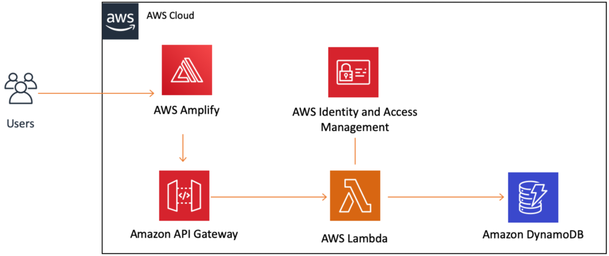

# Project Management App - Full Stack Application

<h2  id="Table_of_content">Table of content</h2>

1. [Description of application](#Description_of_application)
2. [Application Architecture Diagram](#Application_Architecture_Diagram)
3. [Task delegation methodology](#Task_delegation_methodology)
4. [Development testing](#Development_testing)
5. [Production testing](#Production_testing)

<h2 id="Description_of_application"> Description of application. </h2>

This application can be access via https://main.d3m4hunle93grw.amplifyapp.com/

 **- Purpose:** 
The purpose of this app is to create a Work Management Platform that  allows users to manage their work online via a web browser on any device. The app assists in tracking projects and workflows, visualizing data, and collaborating on projects/work to help teams and organizations become more efficient.

This serverless web application utilizes a Python backend and a JavaScript front end to produce an interactive interface. As the backend for the web application is built with AWS Lambda, the application is completely serverless. A Serverless function is triggered based on the event method defined within a frontend request.

Amazon API Gateway is used in this web application for deployment of RESTful APIs. This will allow the web app to make calls to our Lambda function from a web client. The API Gateway interfaces the HTML/Javascript frontend with the Python serverless lambda function backend.

Lambda functions interact with an Amazon DynamoDB table. DynamoDB is a key-value database service and does not require any servers to be managed when accessed.

In addition, the Lambda functions make use of the Amazon Identity and Access Management (IAM) service to securely grant lambda services the permissions needed to interact with the database.

AWS Amplify will host the static web content, consisting of HTML, CSS, and JavaScript. Additionally, Amplify's CI/CD function updates the website when a git branch is updated in the git repository. Furthermore, Amplify offers a URL to access the website.

  

<h2 id="Application_Architecture_Diagram"> Application Architecture Diagram. </h2>

The diagram below provides a visual representation of the services used on this project and how they are connected. This application uses AWS Amplify, Amazon API Gateway, AWS Lambda, and Amazon DynamoDB as pictured below.

[Back to top](#Table_of_content)

<h2 id="Task_delegation_methodology"> Task delegation methodology. </h2>
In order to complete the project on time, I have used agile project management methodologies. The tasks are being tracked through a Trello board and are categorized according to the current status of that task and their deadlines. All tasks have been assigned to me as the sole developer. This has made things difficult for me as my skills set is stongly backend with the use of Python and basic serverless technologies, however, I have little experience in coding with javascript for the front end of the project.

[Back to top](#Table_of_content)

<h2 id="Development_testing"> Development testing. </h2>

Since the backend is composed of lambda functions and all tests were performed on the AWS GUI, I have provided a video showing how these were done. [Video Link](resources/Lambda_function_Tests.mp4)

**Test Application**

*Scenario 1:*

The GET method relies on a lambda function to connect to the DynamoDB.  The function doesn't take any additional arguments. In this test scenario, the Lambda function is expected to connect to the Dynamo BD to retrieve all data contained within it. 

Expectations - The lambda function will connect to the database and retrieve all the data. It will then return a JSON formatted response with a status of 200 and all the data from the database. 

Results – The lambda function returned a json file that contained the status 200 and the data within the DynamoBD.

*Scenario 2:*

The PUT method uses a lambda function to connect to the DynamoDB and update an item's field. Two additional arguments are passed to this function, the item's Key ID value and the item's updated status.

Expectations -  The lambda function connects to the database and passes in the items key id and the updated status. After that, it will display a response in JSON format with a status code of 200 and a message stating that the item has been updated.

Results - The lambda function updated the item's status and returned a JSON file with a status code of 200 and a string message stating the item had been updated. 

[Back to top](#Table_of_content)

<h2 id="Production_testing"> Production testing. </h2>

*Scenario 1:*

Through a gateway API, the front end POST method connects to DynamoDB via a lambda function. This will then create the new task in the database and assign a key value to it. The function takes 4 additional arguments and saves it with a Key ID value corresponding to the current time.

Expectations - . A lambda function connects to the database and saves the created item there. The response will be in JSON format with a status code of 200. A message will also appear saying the item has been saved as a string value in the database  

Results – . Database was updated to include newly created items. Lambda returned a JSON file with a status of 200 and a message saying that the item was saved to the database. This was then displayed to the user.

*Scenario 2:*

The frontend DELETE method relies on the front end to connect to a lambda function through a gateway API which then connects to the DynamoDB. The item will then be deleted from the database using the tasks key ID. The task key ID is passed as an additional argument.

Expectations -. In the lambda function, the database will be accessed and the item will be deleted. The response will be in JSON format with a status code of 200 and a message stating that the item has been deleted from the database. The message is represented as a string.  

Results –. Data for this item has been removed from the database. The lambda function returned a JSON file containing a status of 200 and a message indicating that the item had been removed from the database. That message was then displayed to the user.

[Back to top](#Table_of_content)

